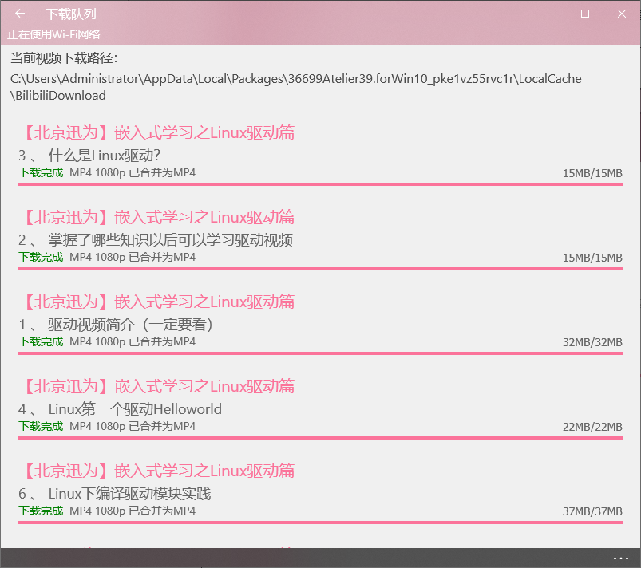
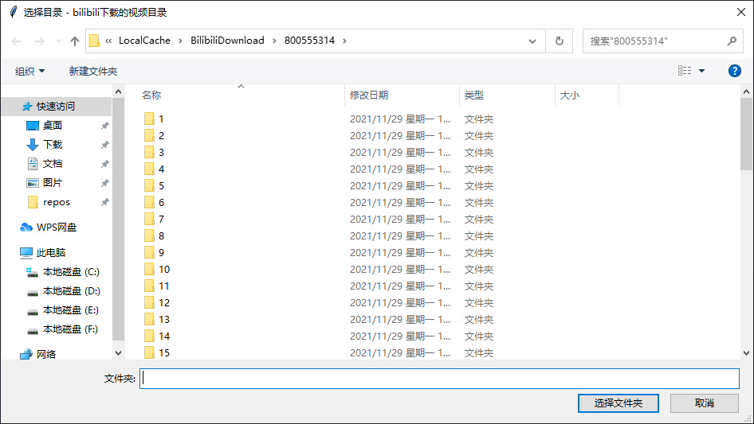
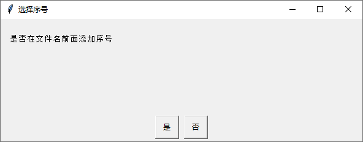

## bilib应用

在微软商店中下载哔哩哔哩动画，虽然软件UI古老，但是贵在稳定和支持下载


安装以后搜索自己想要的视频，然后缓存下载


下载后进入下载的路径



## 视频文件重命名

打开自动命令的程序或者py脚本，选择视频合集下载的路径



选择是否自动添加序号



最后在下载目录的video下面可以找到整合好的视频


## 打包成exe程序

```
 pyinstaller -F -w  -i rename.ico rename.py
```

## python脚本

```
import os
import sys
import json
import shutil
import easygui

isIndex = False

def findname(path):
    with open(path,'r',encoding='utf-8') as load_f:
        load_dict = json.load(load_f)
        partno = load_dict['PartNo']
        partname = load_dict['PartName']
        print(type(partname))
        return partno,partname
        
def mkdir(path):

    # 去除首位空格

    path=path.strip()

    # 去除尾部 \ 符号

    path=path.rstrip("\\")

    # 判断路径是否存在

    # 存在     True

    # 不存在   False

    isExists=os.path.exists(path)

    # 判断结果

    if not isExists:

        # 如果不存在则创建目录

        # 创建目录操作函数

        os.makedirs(path) 

        print(path + ' 创建成功')
        return True
    else:

        # 如果目录存在则不创建，并提示目录已存在

        print(path+' 目录已存在')
        return False

def reorganizefile(mainpath,videopath):
    for fpathe,dirs,fs in os.walk(mainpath):   # os.walk是获取所有的目录
        infofile ="";
        mp4file="";
        for f in fs:
            ##读取info文件
            filename = os.path.join(fpathe,f)
            if filename.endswith(".info"):  # 判断是否是"xxx"结尾
                infofile = filename
                partno,partname = findname(infofile)
            if filename.endswith(".mp4"):
                mp4file = filename
        
        ##如果info文件和mp4文件都存在
        if infofile!="" and mp4file!="" :
            partno,partname = findname(infofile)
            if isIndex :
                partfile = partno+"_"+partname+".mp4"
            else:
                partfile = partname+".mp4"

            changpath =  os.path.join(videopath,partfile)
            shutil.move(mp4file,changpath);

if __name__ == "__main__" :
    mainpath =easygui.diropenbox("bilibili下载的视频目录","选择目录");
    if not mainpath :
        sys.exit()
    mainpath.strip();
    
    if os.path.exists(mainpath):
        isIndex =easygui.ccbox("是否在文件名前面添加序号","选择序号",choices=("是", "否"));
        if not isIndex :
            sys.exit()

        videopath = os.path.join(mainpath,"video")
        mkdir(videopath)
        reorganizefile(mainpath,videopath)
    else :
        print("输入路径错误！！")
```

## github

